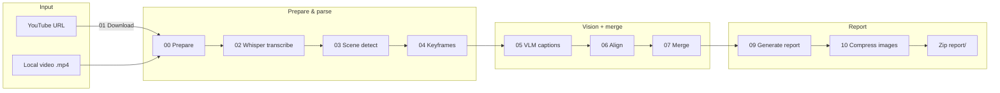
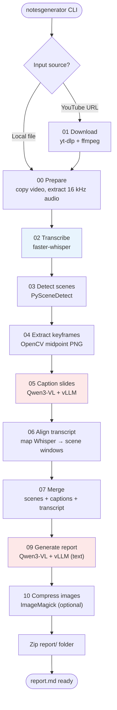
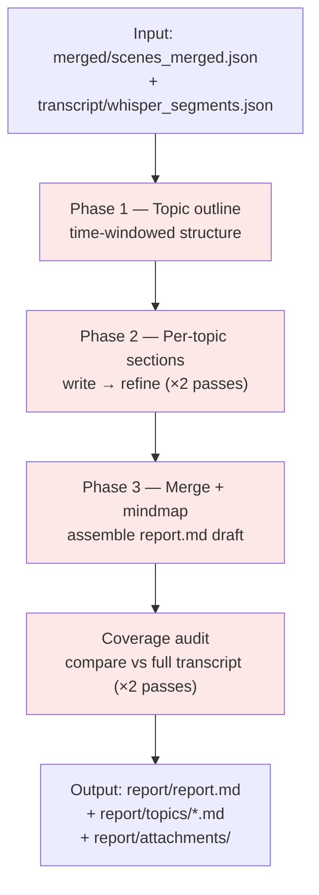

# How NotesGenerator Works

NotesGenerator turns a lecture video into a structured markdown report. This page walks through the end-to-end flow, the models involved, and what each folder under `runs/` contains.

## Quick overview



**Final output:** `runs/<name>/report/report.md` (+ images in `report/attachments/`, optional `<name>_report.zip`).

---

## Entry point

Everything starts from the CLI:

```bash
notesgenerator --video lecture.mp4 --output my_lecture
# or
notesgenerator --url "https://youtube.com/watch?v=..." --output my_lecture
```

`run_pipeline.py` configures the environment (model cache paths, Colab fixes), optionally downloads from YouTube, then calls `run_lecture.py` to execute all steps in order.

---

## Full pipeline flow



Steps highlighted in blue/red use ML models. Everything else is classical video/audio processing.

---

## Models & tools

| Step | What runs | Default model / tool | GPU? |
|------|-----------|----------------------|------|
| 01 Download | `yt-dlp`, `ffmpeg` | — | No |
| 00 Prepare | `ffmpeg` | — | No |
| 02 Transcribe | [faster-whisper](https://github.com/SYSTRAN/faster-whisper) | `medium` (`--whisper-model`) | Yes (CUDA) |
| 03 Detect scenes | [PySceneDetect](https://github.com/Breakthrough/PySceneDetect) ContentDetector | threshold `35`, min length `4s` | No |
| 04 Keyframes | OpenCV | midpoint frame per scene | No |
| 05 Caption slides | **Qwen3-VL** via [vLLM](https://github.com/vllm-project/vllm) | `Qwen/Qwen3-VL-4B-Instruct` | Yes |
| 06–07 Align & merge | Python (no model) | — | No |
| 09 Generate report | **Qwen3-VL** via vLLM (text-only) | same Qwen model | Yes |
| 10 Compress | ImageMagick | palette PNG (default) | No |

### Model details

**Whisper (speech → text)**
- Library: `faster-whisper`
- Default size: `medium` — override with `--whisper-model large-v3` etc.
- Output: timestamped segments in `transcript/whisper_segments.json`

**Qwen3-VL (vision + language)**
- Default: `Qwen/Qwen3-VL-4B-Instruct`
- Override via `QWEN_MODEL` env var or `configure_colab_env(model=...)`
- Loaded in-process with vLLM (no separate server — Colab-friendly)
- Used twice in the default pipeline:
  1. **Step 05** — image captioning: reads each slide keyframe, extracts equations/diagrams/summary
  2. **Step 09** — report writing: builds topic outline, writes sections, refines, and verifies coverage

Model weights are cached under `{data_root}/models/hub/` (Hugging Face cache).

---

## Step 09 — report generation (internal flow)

Report generation is the longest step. It reuses the same Qwen3-VL model but runs several LLM phases:



Key artifacts from this step:

| File | Purpose |
|------|---------|
| `report/topic_outline.json` | Major topics with nested time segments |
| `report/main_scenes.json` | Key slide scenes picked for figures |
| `report/topics/topic_XX.md` | Individual topic write-ups |
| `report/mindmap.md` | Concept mind map |
| `report/coverage_audit_pass_*.json` | Transcript coverage checks |
| `report/report.md` | **Final merged report** |

---

## Run folder layout

Each `--output my_lecture` creates `runs/my_lecture/`:

```
runs/my_lecture/
├── raw/
│   ├── video.mp4          # normalized lecture video
│   └── audio.wav          # 16 kHz mono for Whisper
├── transcript/
│   └── whisper_segments.json
├── scenes/
│   ├── scene_list.json    # detected scene boundaries
│   └── keyframes/
│       └── scene_001.png  # one PNG per scene
├── captions/
│   └── vlm_captions.json  # Qwen descriptions per slide
├── merged/
│   ├── aligned_scenes.json
│   └── scenes_merged.json # checkpoint: scenes + transcript + captions
├── report/
│   ├── report.md          # ← main deliverable
│   ├── topic_outline.json
│   ├── topics/
│   ├── attachments/       # slide images referenced in report
│   └── mindmap.md
└── pipeline_timing.json   # per-step duration breakdown
```

After the pipeline finishes, a zip is created at `{data_root}/my_lecture_report.zip` containing the `report/` folder (unless `--no-zip`).

---

## Data & cache paths

| Path | Contents |
|------|----------|
| `{data_root}/runs/` | All pipeline outputs |
| `{data_root}/models/hub/` | Hugging Face model cache (Whisper + Qwen) |
| `{data_root}/models/torch/` | PyTorch hub cache |

`data_root` defaults to `/content` on Colab, otherwise the current working directory. Override with `--data-dir` or `NOTE_TAKER_ROOT`.

---

## Optional / not in default pipeline

**Step 08 — Obsidian notes** (`08_generate_notes.py`) generates per-scene Obsidian markdown under `notes/`. It is **not** run by the default `notesgenerator` command; the main deliverable is `report/report.md` from step 09.

---

## Configuration cheat sheet

```bash
# Whisper size
notesgenerator --video lecture.mp4 --output run1 --whisper-model large-v3

# VLM batch size (step 05, GPU memory)
notesgenerator --video lecture.mp4 --output run1 --vlm-batch-size 4

# Skip image compression
notesgenerator --video lecture.mp4 --output run1 --no-compress

# Force re-run all cached steps
notesgenerator --video lecture.mp4 --output run1 --force-all

# Custom Qwen model
QWEN_MODEL=Qwen/Qwen3-VL-8B-Instruct notesgenerator --video lecture.mp4 --output run1
```

For Colab, call `configure_colab_env()` before running — it sets paths, fixes the torch stack, and points caches to `/content/models/`.
